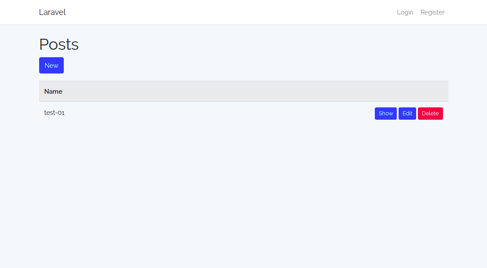
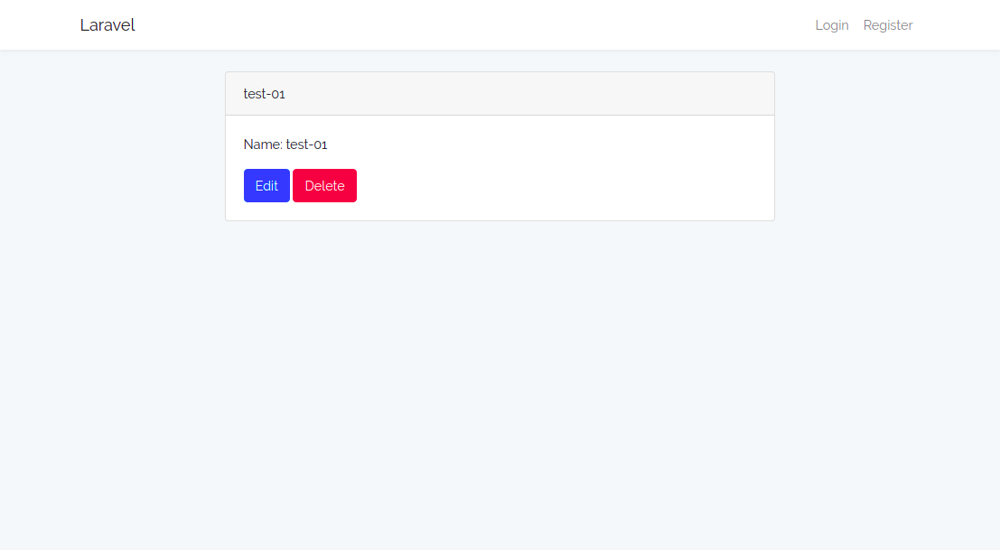
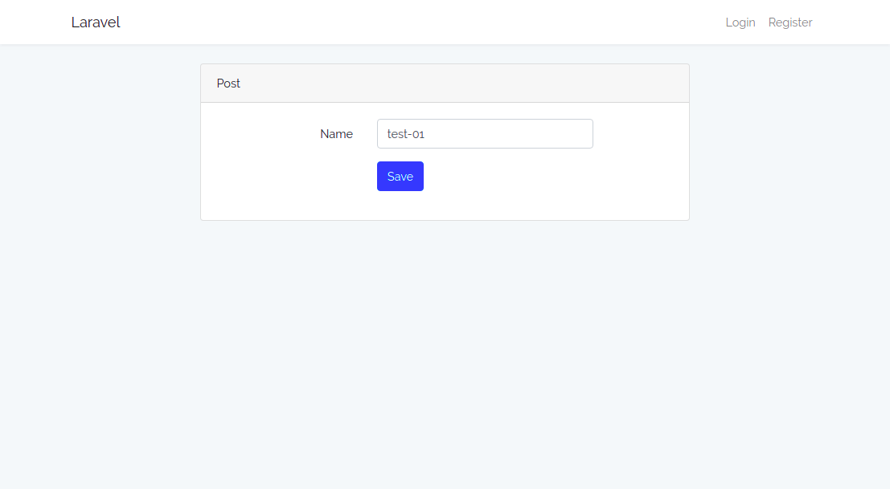

# Laravel Resource Generator

A source code generator for Laravel resources.

In Laravel, you can create a resource controller using the command ```php artisan make:controller PostController --resource```. But:

* the controller contains only empty methods
* you have to manually add request validation
* you have to write all your views

With this plugin, you immediately get working code:

* a fully functional controller with request validation
* basic views to list, create, modify and delete your resource

## Installation

```
$ composer require tdebatty/laravel-resource-generator
```

## Example


```
$ php artisan resource-generator:generate Post
Generate migration and model...
Generate routes...
Generate views...
Generate controller...
Done!
You may now fill the migration file
And then run php artisan migrate
Your resources will be available at http://127.0.0.1:8000/app/posts
```

The default controller and views assume resources have a *name* field. You have to add this field manually to your migration file (and other fields according to your needs):

```
$ nano database/migrations/*_create_posts_table.php
```

You can now migrate and admire the result:

```
$ php artisan migrate
$ php artisan serve
```








## Compatibility

Currently generates code for Laravel 5.6 (Bootstrap 4).